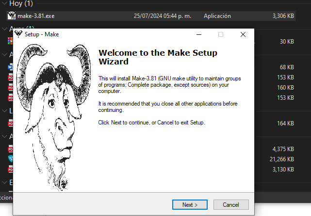
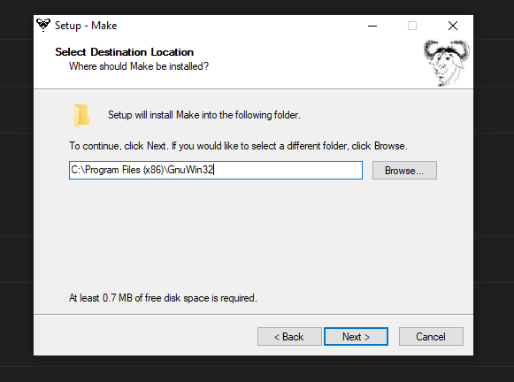
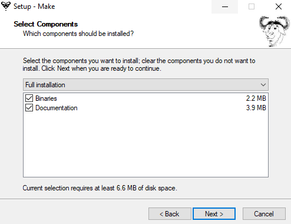
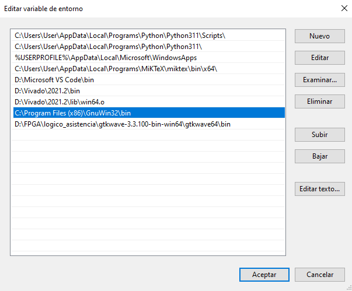

# Guía para la construcción del entorno de desarrollo de código abierto para la FPGA Tang Nano 9k

## Instalación de Visual Studio Code

Se utilizará VSCode como editor de texto y para alojar todo el proceso de diseño, pruebas e implementación física en la FPGA. Puede descargarlo [aquí](https://code.visualstudio.com/?ref=learn.lushaylabs.com).

## Instalación de la extensión Lushay Code

Al abrir `VSCode`, encontrará la sección de extensiones en la columna izquierda, como se muestra en la siguiente imagen:

  

Dentro de las extensiones, busque *Lushay Code* en el cuadro de búsqueda y haga clic en "Instalar", como se indica en la siguiente imagen:

  

## Instalación de otras extensiones necesarias

De manera similar a la instalación de *Lushay Code*, instale *Verilog-HDL/SystemVerilog*. Puede descargarla directamente desde: [*Verilog-HDL/SystemVerilog*](https://marketplace.visualstudio.com/items?itemName=mshr-h.VerilogHDL).

## Instalación del OSS-Cad-Suite de YosysHQ

Para instalar las herramientas necesarias en todo el proceso de diseño, pruebas e implementación, descargue el paquete *OSS-Cad-Suite* desde el siguiente enlace. Guárdelo en la ubicación que desee (esta ubicación será necesaria más adelante).
- Windows: [Descargar aquí](https://github.com/YosysHQ/oss-cad-suite-build/releases/download/2023-02-10/oss-cad-suite-windows-x64-20230210.exe)
- Otros sistemas operativos: [Descargar aquí](https://github.com/YosysHQ/oss-cad-suite-build/releases/tag/2023-02-10)

Si usa Windows, al abrir el archivo descargado, es posible que aparezca la siguiente advertencia:

  

Presione "Más Información" y luego "Ejecutar de todas formas". Esto extraerá los archivos en una carpeta llamada *oss-cad-suite* en la misma ubicación:

  

  

## Configuración de la extensión Lushay Code

Abra VSCode, en la parte inferior derecha, haga clic en *FPGA Toolchain*:

  

Aparecerá un error y la opción "Setup Now". Al hacer clic, seleccione la carpeta *bin* dentro de la carpeta *oss-cad-suite* que extrajo.

Otra forma es abrir la extensión *Lushay Code*, ir a la configuración:

  

  

Allí, copie la ruta de la carpeta *bin* dentro de la carpeta *oss-cad-suite* en la ubicación que la guardó. Preferiblemente, esta ruta no debe contener espacios ni caracteres especiales:

  

Y pegue esa ruta en la sección de *OSS Cad Suite* en la configuración de la extensión:

  

## Configuración del Driver USB de Windows

Es necesario modificar el controlador USB de Windows para programar la FPGA con *openFPGALoader*. Para esto, instale el programa [Zadig](https://zadig.akeo.ie/).

Al instalarlo y abrirlo, se mostrará la ventana del programa. Después de conectar la FPGA al puerto USB de la computadora, vaya a "Options" y seleccione "List All Devices":

  

Luego, seleccione *JTAG Debugger (Interface 0)*:

  

Presione "Replace Driver" y espere a que se complete la acción:

  

## Instalación de GNU-Make

En esta sección se instalará Make para automatizar los comandos de consola que se puedan necesitar en la elaboración de proyectos.

- Para instalar Make haga click [aquí](https://gnuwin32.sourceforge.net/downlinks/make.php)

Ejecute el archivo descargado y acepte los términos:

Seleccione la ruta donde se instalará:

Y acepte en todas las ventanas:

### Agregar Make al Path

Para ejecutar la aplicación desde cualquier proyecto en la consola de VSCode, es necesario agregar la carpeta `bin` que está dentro de la carpeta `GnuWin32` que acaba de instalar a la variable de entorno PATH.

1. **Copie la ruta de la carpeta `bin`:** esta se encuentra en la ruta que seleccionó para la instalación de Make.

    

1. **Edite las variables de entorno del sistema:**
   
   Busque en el cuadro de búsqueda de Windows *variables de entorno*:

   

     
   

2. **Ingrese al editor de variables de entorno y presione *Variables de entorno...*:**
   
   

     
   

3. **Seleccione *Path* y presione *Editar*:**
   
   

     
   

4. **Presione *Nuevo* y pegue la ruta a la carpeta `bin` que copió anteriormente. Finalmente, presione Aceptar en cada ventana.**

    

Con esto se da por concluida la guía de instalación de herramientas, puede continuar con la siguiente guía: [Uso de las herramientas instaladas](https://github.com/DJosueMM/open_source_fpga_environment/wiki/Uso-del-toolchain-para-dise%C3%B1o-en-FPGA)

# Referencias
Esta guía está basada en el siguiente documento: [Getting Setup with the Tang Nano 9k](https://learn.lushaylabs.com/getting-setup-with-the-tang-nano-9k/).

## Ultima actualización:
- David Medina
- 25-07-2024.