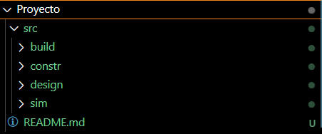
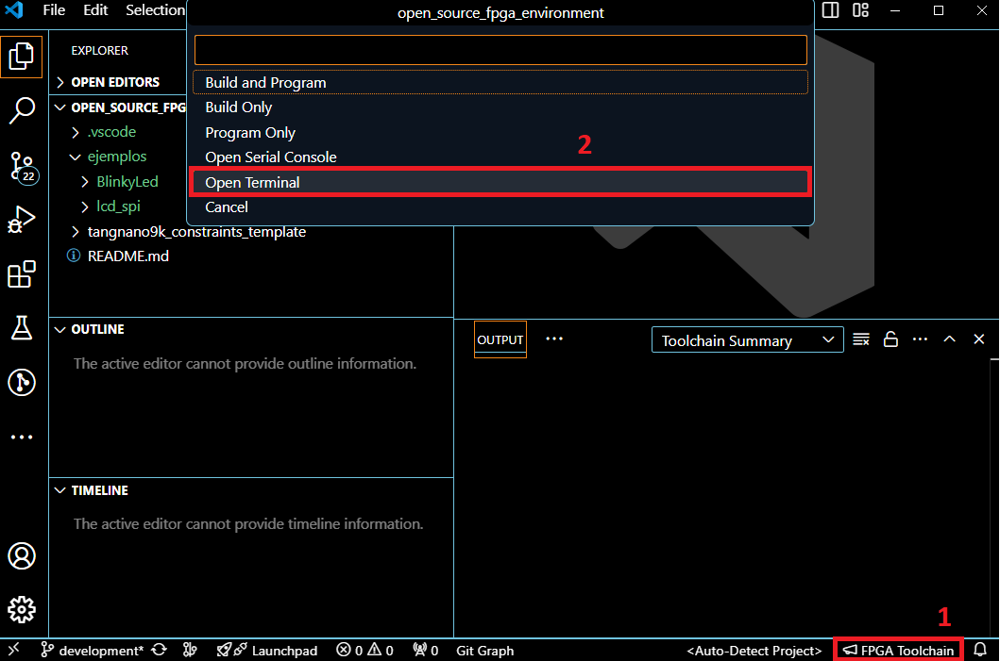
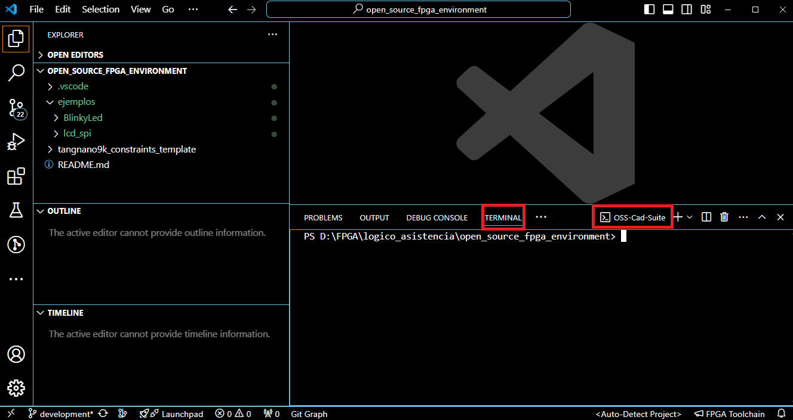
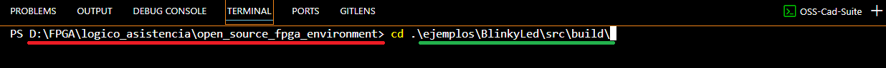
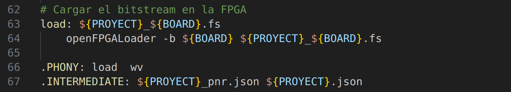

# Tutorial: uso del entorno de desarrollo de código abierto para diseño digital en la FPGA Tang Nano 9k 

## Carpetas y archivos necesarios
Un proyecto de diseño digital desarrollado en una FPGA debe tener los siguientes tipos de archivos:

- Archivos de diseño: estos son los archivos RTL que serán sintetizados. Estos pueden ser `.v` o `.sv`. 

- Archivos de simulación: en estos se escriben los testbench para verificar los diseños realizados por medio de una simulación. Estos pueden ser `.v` o `.sv`.

- Archivo de constraints: es donde se indica a qué pines físicos en la FPGA se asociarán las señales de entrada y salida del módulo top. En nuestro caso, para la FPGA TangNano se usa la extensión `.cst`.

- Archivo Make: este archivo es una receta que contiene los comandos para ejecutar distintas etapas del diseño con las herramientas de código abierto. Por ejemplo, la síntesis, la implementación, la simulación y la carga del diseño en la FPGA. 

Se recomienda el uso de esta jerarquía de carpetas para seguir este tutorial y para sus propios diseños.



Se le proporciona la [plantilla](https://github.com/DJosueMM/EL-3307_template) que puede utilizar para cada proyecto.

## Clonar el repositorio

Para el desarrollo de este tutorial, debe clonar el repositorio https://github.com/DJosueMM/open_source_fpga_environment.git con su método de preferencia.

```sh
git clone https://github.com/DJosueMM/open_source_fpga_environment.git
```

## Uso de la herramienta en VSC

Para comenzar, abra el repositorio clonado en VSC. 
Cuando quiera comenzar un proyecto desde cero puede abrir una carpeta con la plantilla o crear su propio arreglo de carpetas. 

### Inicializar la terminal del toolchain:

Primero que todo se debe ubicar el acceso a las herramientas.

Presione en `FPGA Toolchain` en la parte inferior derecha. Después presione en `Open Terminal`.




Con esto vamos a poder ingresar comandos específicos para tener control total de nuestros diseños. También podremos utilizar recetas en Makefiles para automatizar y facilitar el proceso.

Se debió abrir una terminal de tipo OSS-Cad-Suite.



En esta terminal podremos hacer uso de las herramientas de síntesis, simulación e implementación. 

Para comprobarlo ingrese el comando:

```sh
yosys
```

Este comando ejecuta la suite para síntesis y desarollo de Yosys.


Para salir de la suite de Yosys ingrese el siguiente comando:

```sh
exit
```

### Uso básico de la extensión con recetas:

Todo el toolchain tiene una gran cantidad de comandos, opciones, banderas, etc. Sin embargo, esto se sale del propósito de este tutorial. Es por esto que se ha preparado una pantilla de una receta con todo lo necesario para desarrollar cualquier proyecto.

En la carpeta build de los ejemplos, se encuentra el Makefile que contiene todos los comandos para cada etapa del desarrollo. Cuando desarrollen sus propios proyectos, se recomienda que generen su respectivo Makefile en su carpeta build, siguiendo las plantillas dadas.

Para probar esto, entre a la carpeta build del ejemplo BlinkyLed. 
Con el comando **cd** se ingresa a una dirección relativa a la actual. Entonces para ir a la deseada ingresamos el siguiente comando:

```sh
cd .\ejemplos\BlinkyLed\src\build\
```

De la dirección actual (rojo) se sigue la ruta indicada por la dirección al destino (verde)



El objetivo es estar en la misma ubicación del Makefile. Una vez en la carpeta build se pueden ejecutar las recetas. Estos deben ser ingresados en la terminal OSS-CAD-SUITE como se indica anteriormente en esta guía.

#### Para la verificación de los diseños y simulación tenemos los siguientes comandos:

Para ejecutar el testbench y simular el diseño:
```sh
make test
```
Ejecute este comando en la terminal, esto generará en la carpeta build un archivo .vcd que contiene las señales simuladas en función del tiempo. Además se mostrará en la consola los resultados o tareas del testbench.

Para visualizar los diagramas de tiempo con GTKwave:
```sh
make wv
```

Ejecute este comando en la terminal, esto abrirá una ventana de gtkwave para visualizar las señales en función del tiempo.

#### Para la implementación física tenemos los siguientes comandos:

Para verificar la sintaxis y sintetizar los diseños RTL:
```sh
make synth
```
Ejecute este comando en la terminal, esto generará en la carpeta build un archivo .json con el diseño sintetizado y un logfile con la información del proceso de síntesis. Si existe un error de sintaxis o de diseño, será reportado en este logfile.

Para realizar el place and route del diseño sintetizado en la FPGA:
```sh
make pnr
```
Ejecute este comando en la terminal, esto generará en la carpeta build un archivo .json con el diseño implementado en el espacio físico de la FPGA y un logfile con la información del proceso de place and route. Si existe un error, será reportado en este logfile.

Para generar el bitstream que contiene el diseño:
```sh
make bitstream
```
Ejecute este comando en la terminal, esto generará en la carpeta build un archivo .fs que tiene una cadena binaria con toda la información del diseño.

Para cargar el bitstream en la FPGA a través del puerto serial de la computadora:
```sh
make load
```
Conecte la FPGA y ejecute este comando en la terminal, esto cargará el bitstream en la FPGA. La información del proceso es mostrada en la consola.

Para ejecutar todos los comandos de implementación física anteriores de una sola vez:
```sh
make all
```
Ejecute este comando en la terminal, esto ejecutará todos los comandos para pasar desde el RTL hasta la carga en la FPGA.

#### Evaluación de lo aprendido

Navegue por las carpetas usando la terminal hasta llegar a la carpeta build del ejemplo __lcd_spi__. Con el comando cd .. regresa a una carpeta superior.

```sh
cd ..
```

Y con la tecla tab en el teclado, puede autocompletar rutas.

Simule el diseño, visualice los diagramas de tiempos y cargue el diseño en la FPGA.

### Contenido de un Makefile

En esta sección se muestra como editar el Makefile para utilizarlo en cualquier proyecto.

Al inicio del Makefile, se pueden apreciar distintas variables. Estas variables son las únicas que se deben editar en función de las fuentes de cada proyecto.


 - __Board__: es la tarjeta en la que se encuentra el chip FPGA. Esta variable no se debe editar siempre que se use la FPGA  en la tarjeta TangNano9k.
 - __Family__: indica a la familia de chips FPGA al que pertenece el dispositivo. Esta variable no se debe editar siempre que se use la FPGA en la TangNano9k.
 - __Device__: es el chip FPGA que se encuentra en la tarjeta TangNano9k. Esta variable no se debe editar siempre que se use la FPGA TangNano9k.
  
En cuanto a las variables que se deben revisar y modificar están las siguientes:

- __PROYECT__: esta variable no tiene ningun efecto funcional, solo indica los nombres de los archivos que se generarán. Esta se debe modificar con un nombre referente al proyecto que se esté realizando y es a criterio personal.

- __SOURCES__: indica la ruta a cada archivo de diseño RTL, en nuestro caso es la carpeta design dentro de src.
    - Se puede indicar la ruta a cada archivo individualmente.
    - Con el comando wildcard, se incluyen todos los archivos .v o .sv que se encuentren en la carpeta.
    - Cada método es válido y depende de las necesidades de cada uno. Solamente se debe respetar la sintaxis que se muestra en la plantilla.

- __TESTBENCH__: indica la ruta a cada archivo de simulación RTL, en nuestro caso están en la carpeta sim dentro de src.
    - Se debe indicar la ruta al archivo .v o .sv que contiene el testbench a ser simulado.

- __CONSTRAINTS__: indica la ruta al archivo de constraints .cst, en nuestro caso están en la carpeta constr dentro de src.
    - Se debe indicar la ruta al archivo .cst que contiene los constraints para la implementación física.

- __TOP_DESIGN__: indica el nombre del módulo con mayor jerarquía, el modulo top. No se debe poner la ruta al archivo, sino el nombre del módulo dentro del archivo. Por ejemplo:

    
    
    el nombre del módulo es el resaltado en la figura anterior __module_spi_lcd__.

- __TOP_TB__: indica el nombre del módulo del testbench a simular. No se debe poner la ruta al archivo, sino el nombre del módulo dentro del archivo. Por ejemplo:

    

    el nombre del módulo del testbench es el resaltado en la figura anterior __module_top_deco_gray_tb__.

- __VCD_FILE__: indica el nombre del archivo vcd que se generará al simular el testbench. No se debe poner la ruta al archivo, sino el nombre del dump file que se especifica en el testbench junto con su extensión. Por ejemplo:

    

    El nombre del dumpfile se indica con el comando __$dumpfile__, en este caso __module_top_deco_gray.vcd__ y esto es lo que se coloca en la variable VCD_FILE.

    Este bloque deberá ir en todos los testbench que realicen. Se compone de:
    - __$dumpfile__ para generar el archivo que contendrá la información. 
    - __$dumpvars__ donde se indica el nombre del modulo del testbench. Tal como se explica en la variable TOP_TB.
    
    Esto lo que hace es almacenar los datos de simulación en un archivo vcd (value change dump). Que es indispensable para visualizar los diagramas de tiempo.

Por último, se tienen las recetas con los comandos. Estos no se deberían de modificar, ya que fueron escritos en función de las variables anteriormente explicadas.




Con un primer acercamiento a las herramientas y su uso, puede continuar con la siguiente guía [Crear diseños propios: verificarlos, sintetizarlos e implementarlos en la FPGA](https://github.com/DJosueMM/open_source_fpga_environment/wiki/Primer-dise%C3%B1o,-desde-el-RTL-hasta-el-bitstream).

## Ultima actualización:
- David Medina
- 27-07-2024.