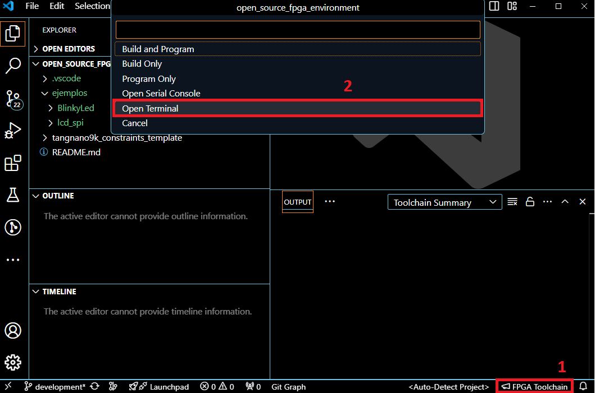
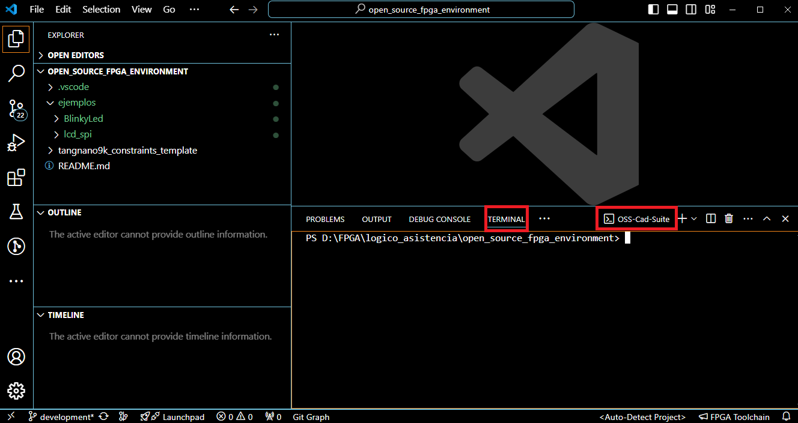
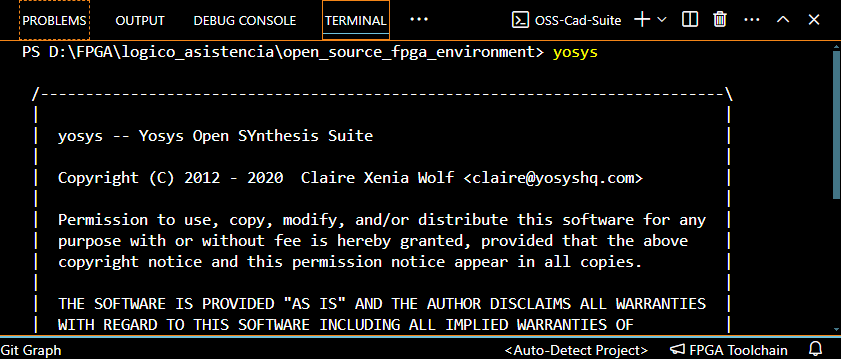
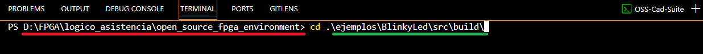

# Tutorial: uso del entorno de desarrollo de código abierto para diseño digital en la FPGA Tang Nano 9k 

## Carpetas y archivos necesarios
Un proyecto de diseño digital desarrollado en una FPGA debe tener los siguientes tipos de archivos:

- Archivos de diseño: estos son los archivos RTL que serán sintetizados. Estos pueden ser `.v` o `.sv`. 

- Archivos de simulación: en estos se escriben los testbench para verificar los diseños realizados por medio de una simulación. Estos pueden ser `.v` o `.sv`.

- Archivo de constraints: es donde se indica a qué pines físicos en la FPGA se asociarán las señales de entrada y salida del módulo top. En nuestro caso, para la FPGA TangNano se usa la extensión `.cst`.

- Archivo Make: este archivo es una receta que contiene los comandos para ejecutar distintas etapas del diseño con las herramientas de código abierto. Por ejemplo, la síntesis, la implementación, la simulación y la carga del diseño en la FPGA. 

Se recomienda el uso de esta jerarquía de carpetas para seguir este tutorial y para sus propios diseños.


Se le proporciona la  que puede utilizar para cada proyecto.

## Clonar el repositorio

Para el desarrollo de este tutorial, debe clonar el repositorio https://github.com/DJosueMM/open_source_fpga_environment.git con su método de preferencia.

```sh
git clone https://github.com/DJosueMM/open_source_fpga_environment.git
```

## Uso de la herramienta en VSC

Para comenzar abra el repositorio clonado en VSC. Cuando quiera comenzar un proyecto desde cero puede abrir una carpeta con la plantilla o crear su propio arreglo de carpetas. 

### Inicializar la terminal del toolchain:

Primero que todo se debe ubicar el acceso a las herramientas.

Presione en `FPGA Toolchain` en la parte inferior derecha. Después presione en `Open Terminal`.




Con esto vamos a poder ingresar comandos específicos para tener control total de nuestros diseños. También podremos utilizar recetas en Makefiles para automatizar y facilitar el proceso.

Se debió abrir una terminal de tipo OSS-Cad-Suite.



En esta terminal podremos hacer uso de las herramientas de síntesis, simulación e implementación. 

Para comprobarlo ingrese el comando:

```sh
yosys
```

Este comando ejecuta la suite para síntesis y desarollo de Yosys.



Para salir de la suite de Yosys ingrese el siguiente comando:

```sh
exit
```

### Uso básico de la extensión con recetas:

Todo el toolchain tiene una gran cantidad de comandos, opciones, banderas, etc. Sin embargo, esto se sale del propósito de este tutorial. Es por esto que se ha preparado una pantilla de una receta con todo lo necesario para desarrollar cualquier proyecto.

En la carpeta build de los ejemplos, se encuentra el Makefile que contiene todos los comandos para cada etapa del desarrollo. Cuando desarrollen sus propios proyectos, se recomienda que generen su respectivo Makefile en su carpeta build, siguiendo las plantillas dadas.

Para probar esto, entre a la carpeta build del ejemplo BlinkyLed. 

Con el comando **cd** se ingresa a una dirección relativa a la actual. Entonces para ir a la deseada ingresamos el siguiente comando:

```sh
cd .\ejemplos\BlinkyLed\src\build\
```

De la dirección actual (rojo) se sigue la ruta indicada por la dirección al destino (verde)



